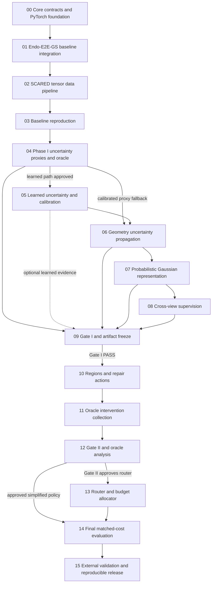

# ReliableEndo-GS master roadmap

## Program objective

ReliableEndo-GS is executed as a gated evidence chain:

```text
ProbStereo-EndoGS
  -> calibrated, uncertainty-aware Gaussian representation
  -> RiskRoute-GS
  -> selective repair and measured-cost compute allocation
```

Phase I must establish a reliable representation independently. Phase II may consume the frozen Phase I evidence, but must not redefine its uncertainty semantics to make routing easier. The program succeeds only if the final system improves the reconstruction quality-cost frontier at matched measured compute; adding capacity alone is insufficient.

## Dependency graph



All dependencies point backward to completed evidence. The dashed Plan 05 dependency means learned uncertainty is optional if Plan 04 selects a calibrated proxy. A failed gate cannot be bypassed by following an implementation arrow.

## Gate locations

**Gate I** is Plan 09, after Phase I uncertainty, propagation, probabilistic representation, and cross-view evaluation, and before any Phase II action implementation. It either freezes an immutable Phase I artifact, approves a documented proxy-based pivot, or stops Phase II.

**Gate II** is Plan 12, after the real three-action oracle intervention study and before router implementation. It approves a dual-source router only if STOP, stereo repair, and Gaussian repair exhibit useful heterogeneous measured utility. Otherwise it selects a simpler policy or stops routing work.

## Milestone table

| ID | Name | Scientific stage | Prerequisite | Primary output | Gate dependency | Recommended model |
| --- | --- | --- | --- | --- | --- | --- |
| 00 | Core contracts and PyTorch foundation | Infrastructure | Repository architecture | Tensor contracts and CPU scientific foundation | None | Sol |
| 01 | Endo-E2E-GS baseline integration | Baseline | 00 | Pinned upstream adapter and parity evidence | Blocks baseline work | Sol |
| 02 | SCARED tensor data pipeline | Data | 00, 01 convention audit | Deterministic `StereoBatch` pipeline and frozen split | Blocks reproduction | Terra |
| 03 | Baseline reproduction | Baseline | 01, 02 | Immutable baseline artifact | Baseline exit criterion | Sol |
| 04 | Uncertainty proxies and oracle | Phase I | 03 | Proxy/oracle evidence and learned-path decision | Early Phase I stop | Sol |
| 05 | Learned uncertainty and calibration | Phase I | 04 approval | Calibrated uncertainty artifact | Optional proxy fallback | Sol |
| 06 | Geometry uncertainty propagation | Phase I | 04 or 05 calibrated uncertainty | Verified center-covariance implementation | Supports Gate I | Sol |
| 07 | Probabilistic Gaussian representation | Phase I | 06 | Two-covariance renderer evidence | Supports Gate I | Sol |
| 08 | Cross-view supervision | Phase I | 07 | Cross-view model/evaluation evidence | Supports Gate I | Sol |
| 09 | Gate I and artifact freeze | Gate I | 04-08 applicable evidence | Immutable Phase I artifact or stop decision | Gate I | Sol |
| 10 | Regions and repair actions | Phase II | Gate I PASS | Independent MVP actions and action checkpoints | Requires Gate I | Sol |
| 11 | Oracle intervention collection | Phase II | 10 | Immutable intervention artifact | Prepares Gate II | Sol |
| 12 | Gate II and oracle analysis | Gate II | 11 | Router approval, simplification, or stop decision | Gate II | Sol |
| 13 | Router and budget allocator | Phase II | Gate II router approval | Router artifact and allocator | Requires Gate II | Sol |
| 14 | Final matched-cost evaluation | Final evaluation | 12 and 13 if approved | Traceable final report artifact | Enforces both gates | Sol |
| 15 | External validation and release | Release | 14 | Reproducible release and external report | Claims limited by gate outcomes | Terra with Sol review |

## State transitions

```text
repository foundation
  -> pinned integration and data protocol
  -> baseline artifact
  -> Phase I artifact
  -> oracle intervention artifact
  -> router artifact, only if Gate II passes
  -> final report and reproducible release
```

Each transition records immutable upstream identities. No milestone discovers scientific input through `latest.pt`, timestamp sorting, or manually copied metrics. If a gate chooses a pivot, the chain records that decision and omits unsupported downstream artifact types.

## Execution rules

- Plans are executed in dependency order; a plan may start only when its prerequisites and required gate decision exist.
- Code existence is not completion. Every plan requires its tests, validation, experiment evidence, acceptance criteria, and artifact/provenance checklist.
- The baseline remains scientifically unmodified. Research behavior enters only after the baseline artifact is accepted.
- Phase I never imports Phase II concepts. Phase II consumes one frozen Phase I identity.
- Oracle collection and deployment invoke the same action implementations from identical pre-action state semantics.
- Calibration, thresholds, and model selection use validation sequences only. Test sequences remain untouched until the frozen evaluation protocol runs.
- Real datasets and large artifacts remain external; committed manifests contain portable identities and hashes, never private medical data.
- Negative results are retained. A stop condition selects the documented pivot instead of weakening a gate or changing a metric after the fact.
- Equations have the single module owners named in the individual plans and `docs/architecture.md`.

## Cross-plan consistency audit

1. Every prerequisite references an earlier plan or an artifact produced by one; the optional Plan 04 -> Plan 06 proxy path is explicit.
2. Plans 04-09 contain no Phase II action, oracle-routing, router-label, or budget dependency.
3. Plan 13 is programmatically and scientifically blocked until Plan 12 explicitly approves router development.
4. Plan 02 implements SCARED tensors before Plan 03 attempts baseline reproduction.
5. Plan 00 contracts precede the Plan 01 Endo-E2E-GS adapter.
6. Plans 10-11 require oracle, runtime, evaluation, training, and profiling to resolve the same action registry implementations.
7. Plan 09 freezes one Phase I artifact before Plans 10-13 may start.
8. Every plan names its output identity and the upstream/config/split/code provenance it must retain.
9. Hypotheses remain questions or acceptance tests; no plan assumes covariance, cross-view, action, routing, or external-validation success.
10. Learned uncertainty, covariance, cross-view, Gaussian repair, dual-source routing, and learned-router failures each have a viable retained-output pivot.
11. All dataset plans preserve `RELIABLE_ENDO_DATA_ROOT` and portable logical identities.
12. Plans prohibit committing private/medical data, copied subsets, credentials, or machine paths.
13. Only the Plan 01 baseline adapter directly understands `third_party/endo_e2e_gs` internals.
14. Disparity/depth, backprojection, covariance propagation, support covariance, marginalization, oracle utility, and profiling each have one named future owner.
15. Plan 14 permits the primary quality-cost claim only from matched end-to-end measured compute on shared hardware.

## Detailed plans

- [Plan 00](plans/00_core_contracts_and_torch_foundation.md)
- [Plan 01](plans/01_endo_e2e_gs_baseline_integration.md)
- [Plan 02](plans/02_scared_tensor_data_pipeline.md)
- [Plan 03](plans/03_baseline_reproduction.md)
- [Plan 04](plans/04_phase1_uncertainty_proxies_and_oracle.md)
- [Plan 05](plans/05_phase1_learned_uncertainty_and_calibration.md)
- [Plan 06](plans/06_phase1_geometry_uncertainty_propagation.md)
- [Plan 07](plans/07_phase1_probabilistic_gaussian_representation.md)
- [Plan 08](plans/08_phase1_cross_view_supervision.md)
- [Plan 09](plans/09_phase1_gate_and_artifact_freeze.md)
- [Plan 10](plans/10_phase2_regions_and_repair_actions.md)
- [Plan 11](plans/11_phase2_oracle_intervention_collection.md)
- [Plan 12](plans/12_phase2_gate_and_oracle_analysis.md)
- [Plan 13](plans/13_phase2_router_and_budget_allocator.md)
- [Plan 14](plans/14_final_matched_cost_evaluation.md)
- [Plan 15](plans/15_external_validation_and_reproducible_release.md)
