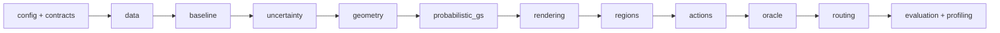
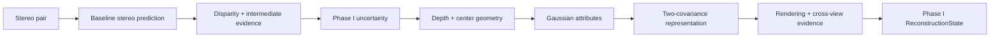
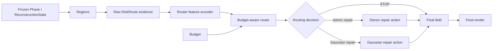

# ReliableEndo-GS system architecture

## Document status

This document is the canonical component-level architecture for ReliableEndo-GS. It specifies boundaries and intended dependency direction; it does not claim that planned scientific components exist.

Status labels have strict meanings:

- **IMPLEMENTED**: code or documentation exists in this repository and is covered by the current validation workflow.
- **PLANNED**: required by the approved research design, but not implemented yet.
- **FUTURE / OPTIONAL**: intentionally outside the MVP and permitted only after the stage gates justify it.

The approved research order is fixed: reproduce the baseline, establish Phase I uncertainty, build the probabilistic Gaussian representation, pass Gate I, freeze the Phase I artifact, build and measure Phase II actions, pass oracle Gate II, then train a router and run matched-cost evaluation.

## System purpose

ReliableEndo-GS is a two-stage research program:

```text
Phase I: ProbStereo-EndoGS
            -> calibrated reliability representation
Phase II: RiskRoute-GS
```

ProbStereo-EndoGS establishes uncertainty-aware reconstruction evidence. RiskRoute-GS consumes that frozen evidence to decide whether and where conditional repair is worth its cost. The relationship is one-way: Phase II must not redefine Phase I uncertainty semantics merely to make routing easier.

## Component map



This is a conceptual dependency graph, not a directory-presence claim. Dependencies flow left to right. Lower-level components must not import higher-level policy components to obtain labels, budgets, or behavior.

| Component | Status | Responsibility |
| --- | --- | --- |
| `config` | **IMPLEMENTED** | Typed configuration loading, validation, and hashing. |
| `runtime` | **IMPLEMENTED** | Run initialization, logging, and reproducibility metadata. |
| `data` | **IMPLEMENTED** | External dataset path resolution, registry metadata, adapters, and split contracts without tensor loading. |
| `utils` | **IMPLEMENTED** | Small cross-cutting utilities that do not own scientific semantics. |
| `cli` | **IMPLEMENTED** | Minimal command-line entry points for implemented infrastructure. |
| `contracts` | **IMPLEMENTED** | Stable PyTorch tensor exchange objects described in `docs/contracts.md`; no scientific algorithms. |
| `baseline` | **PLANNED** | Adapter-owned execution of the pinned Endo-E2E-GS baseline. |
| `uncertainty` | **PLANNED** | Proxy/oracle and learned disparity uncertainty for Phase I. |
| `geometry` | **PLANNED** | Disparity/depth conversion, backprojection, and center-covariance propagation. |
| `probabilistic_gs` | **PLANNED** | Gaussian attributes, surface covariance, and uncertainty marginalization. |
| `rendering` | **PLANNED** | Backend-neutral rendering interface and render evidence. |
| `regions` | **PLANNED** | Region construction and raw risk evidence. |
| `actions` | **PLANNED** | Independently callable STOP, stereo-repair, and Gaussian-repair operators. |
| `oracle` | **PLANNED** | Measured intervention evaluation and utility labels. |
| `routing` | **PLANNED** | Budget-aware action choice without action mechanics. |
| `training` | **PLANNED** | Stage-specific training entry points; no monolithic trainer. |
| `evaluation` | **PLANNED** | Read-only metrics and matched-cost comparisons. |
| `profiling` | **PLANNED** | Measured latency, memory, and cost accounting. |
| Additional learned policies or joint training | **FUTURE / OPTIONAL** | Only after the MVP gates and ablations support added complexity. |

## Canonical future source layout

The intended package structure is:

```text
src/reliable_endo_gs/
  config/               # IMPLEMENTED
  runtime/              # IMPLEMENTED
  data/                 # IMPLEMENTED
  contracts/            # IMPLEMENTED
  baseline/             # PLANNED
  uncertainty/          # PLANNED
  geometry/              # PLANNED
  probabilistic_gs/     # PLANNED
  rendering/            # PLANNED
  regions/              # PLANNED
  actions/              # PLANNED
  oracle/               # PLANNED
  routing/              # PLANNED
  training/             # PLANNED
  evaluation/           # PLANNED
  profiling/            # PLANNED
  utils/                # IMPLEMENTED
```

Directories are created only when their first approved implementation milestone begins. A future directory name is not authorization to create placeholder packages.

## Hard architectural boundaries

### Third-party baseline boundary

Third-party Endo-E2E-GS code is reachable only through this chain:

```text
third_party/endo_e2e_gs
        -> baseline adapter
        -> ReliableEndo-GS contracts
```

No other ReliableEndo-GS package may import third-party implementation modules directly. The adapter owns input translation, output normalization, upstream-version checks, and baseline-specific compatibility code. Details are in `docs/third_party_integration.md`.

### Phase I boundary

Phase I owns uncertainty estimation, geometry, Gaussian construction, covariance marginalization, rendering evidence, and the resulting `ReconstructionState`. It must run without `regions`, `actions`, `oracle`, or `routing`.

Phase I code must not consume action outcomes, oracle labels, router labels, routing decisions, or a budget allocator. In the MVP, router-supervised or jointly optimized Phase I semantics are prohibited. This keeps the uncertainty representation independently testable and prevents policy information from leaking into reconstruction.

Read-only Phase I evaluation and profiling may consume Phase I outputs, but they cannot introduce Phase II dependencies or alter reconstruction state.

### Phase II boundary

Phase II consumes a frozen, identified Phase I artifact. It owns region construction, repair actions, oracle intervention measurement, router feature encoding, routing, and budget allocation. It may derive raw evidence from a `ReconstructionState`, but it must not silently change Phase I weights or semantics.

Each action is an independent operator. Oracle generation, action training, evaluation, runtime routing, and profiling must call the same action implementation. The oracle may choose and measure actions but cannot duplicate their mechanics. The router may select an action but cannot implement it.

Evaluation and profiling observe explicit inputs and outputs. They never mutate a reconstruction state, train a model, apply an unreported preprocessing step, or replace measured cost with an undocumented proxy.

## Phase I runtime



The Phase I path is independently executable. Its public output is the reconstruction state and its provenance, never a routing decision.

The two covariance terms have different scientific meanings:

- surface covariance describes the extent and orientation of a scene Gaussian;
- center covariance describes uncertainty in the estimated Gaussian center induced by disparity uncertainty;
- effective covariance is the explicitly defined result of marginalizing or combining those two terms for a specified consumer.

These terms must remain distinguishable in contracts, artifacts, logs, and ablations.

## Phase II runtime



`RiskRoute` denotes the conceptual Phase II state assembled from region-level raw evidence. The raw evidence schema and the router's encoded feature representation are separate and independently versioned. The diagram permits one selected repair in the MVP; any iterative policy is future work and requires explicit cost and state-transition semantics.

## Training and evidence flow

Training is split into separate flows with explicit artifact dependencies:

1. Baseline reproduction produces a validated baseline artifact.
2. Phase I uncertainty work first establishes proxy/oracle evidence, then trains or calibrates learned uncertainty when justified.
3. Phase I probabilistic Gaussian work consumes the baseline and uncertainty outputs and must pass Gate I.
4. Phase I is frozen and identified before any Phase II action training or intervention dataset generation.
5. Actions are implemented and measured through the oracle; Gate II requires useful intervention headroom under measured cost.
6. Router training begins only after Gate II and consumes versioned oracle labels/features.
7. Final evaluation compares methods under matched compute or latency budgets.

There is no single trainer that jointly owns all stages. Each training flow declares the input artifact identities, data split identity, configuration hash, seed, and output schema.

## Tensor, coordinate, and unit policy

All geometry-bearing contracts and functions must explicitly declare:

- image indexing order and tensor layout;
- pixel-center convention;
- camera intrinsic convention;
- direction and multiplication convention for camera/world transforms;
- metric depth axis and valid range;
- disparity sign, reference view, and units;
- stereo-baseline direction and units;
- the coordinate frame of Gaussian means, rotations, and covariances.

There are no implicit project-wide defaults until they are chosen from verified baseline behavior and recorded in contracts. Conversion is performed once at an owned boundary, not opportunistically in consumers. Analytic-camera tests are required before real-data geometry is trusted.

## Formula ownership

Future scientific equations have one owning module:

| Future module | Owned semantics |
| --- | --- |
| `geometry/disparity.py` | Disparity to metric depth and its inverse. |
| `geometry/backprojection.py` | Metric depth to camera-frame 3D coordinates. |
| `geometry/covariance_propagation.py` | Disparity uncertainty to 3D center covariance. |
| `probabilistic_gs/support_covariance.py` | Rotation and scale to Gaussian surface covariance. |
| `probabilistic_gs/marginalization.py` | Surface covariance plus center covariance to effective covariance. |
| `oracle/utility.py` | Measured quality gain and measured cost to oracle utility. |
| `profiling/` | Runtime, memory, and cost measurement. |

Callers consume the owner rather than reimplementing formulas. Numerical stabilization is named, configurable, tested, and reported; it is not hidden in unrelated code.

## Renderer roles

The production renderer is a future GPU backend used for experiments. A deterministic CPU reference backend is planned only for small correctness and contract tests, not for performance conclusions. A common renderer abstraction should be introduced only after the pinned baseline's rendering API and required semantics are known; designing it earlier would risk encoding false assumptions.

## Data integration

The implemented dataset path remains:

```text
dataset YAML -> path resolver -> dataset registry -> adapter
             -> split manifest -> future sample index -> future loader
```

External datasets remain outside Git and are located through `RELIABLE_ENDO_DATA_ROOT`. Scientific loaders will consume the existing dataset and split contracts when their milestone begins. This architecture does not invent an EndoMapper or SCARED directory layout, silently split data, or introduce tensor loading. See `docs/data_architecture.md` and `docs/server_data_setup.md`.

## Failure-tolerant research design

The component boundaries preserve useful research outcomes when a hypothesis fails:

- If learned uncertainty fails, calibrated proxy/oracle uncertainty remains evaluable.
- If center covariance yields no reconstruction headroom, uncertainty diagnostics and the base Gaussian path remain intact.
- If Gaussian repair rarely wins, Phase II can reduce to STOP plus stereo repair without redesigning Phase I.
- If routing yields no matched-cost benefit, oracle intervention results remain a valid upper-bound and failure analysis.

These are declared pivots, not permission to change metrics or gates after observing results.

## Architecture consistency audit

The architecture answers the required review questions as follows:

1. **Can Phase I run without Phase II?** Yes; its terminal output is `ReconstructionState` and it has no Phase II dependency.
2. **Can Phase II consume a frozen Phase I artifact?** Yes, by immutable identity and validated schema.
3. **Can actions run without a router?** Yes; each action is independently callable through `RepairAction`.
4. **Can the oracle use exactly the same actions as deployment?** Yes; both resolve the same stable action implementations.
5. **Is Endo-E2E-GS isolated?** Yes; only the baseline adapter imports its internals.
6. **Can dataset location change without code changes?** Yes; the environment-root resolver and dataset YAML provide indirection.
7. **Can each scientific formula have one canonical implementation?** Yes; formula ownership is assigned by module.
8. **Can a negative result remove a research branch without breaking unrelated modules?** Yes; uncertainty, covariance, action, and routing pivots preserve their upstream contracts.
9. **Can every final result be traced to configuration, split, code, and upstream artifacts?** Yes; the artifact manifest requires all four identities plus schemas and measured-cost context.
10. **Are unimplemented components clearly marked as planned?** Yes; the status table and future layout distinguish implemented, planned, and optional work.

The supporting specifications are `docs/contracts.md`, `docs/third_party_integration.md`, `docs/artifact_lifecycle.md`, `docs/execution_pipeline.md`, and `docs/testing_strategy.md`.

## Implementation roadmap

The gated implementation sequence is maintained in [PLAN.md](../PLAN.md). Its milestone plans operationalize this architecture without changing the component boundaries or scientific claims defined here.
